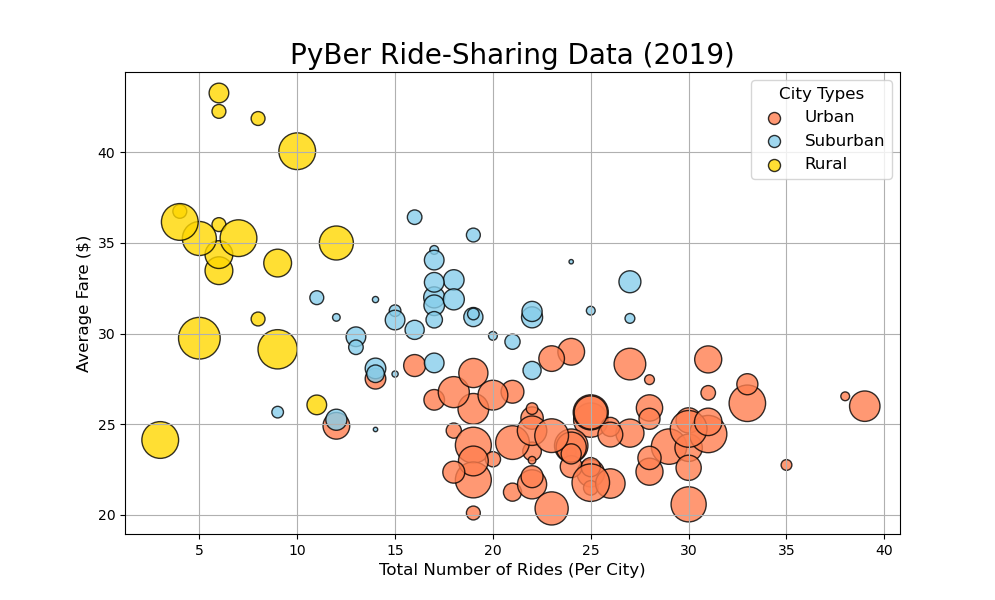
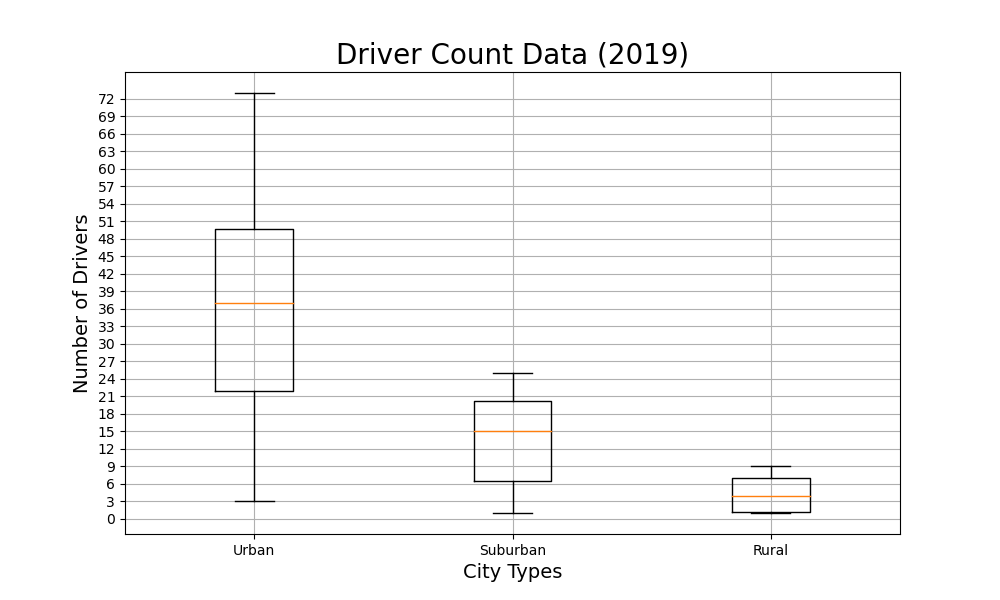

# PyBer Company Ride Share Analysis 
##Overview of the analysis:
o	The purpose of this analysis is to explain connections between three types of cities in terms of ride share data. We will be examining variations between the number of drivers and riders, as well as the percentage of total fares, riders, and drivers in urban, suburban, and rural city types. Our results will help Pyber improve client accessibility to Pyber ridesharing customer services and underline affordability for underserved neighborhoods.
#Results:
o	Between the urban, suburban, and rural city types is a noticeable difference relating to the total rides, total drivers, and fare amounts. The data frame from our Pyber summary analysis below represents these differences: 
###Summary Data Frame

o	This data fram also shows that rural cities holding the highest average fare per ride and average fare per driver while urban and suburban cities with more total rides, total drivers, and total sum of fares. 

o	The line graph shown below represents the total fares by city type from January 2019 through May 2019. From this chart we can see urban cities with the highest total fares, suburban cities achieved the second most, while rural had the lowest return on total fares. Additionally, this chart indicates the third week in February as the highest total fares across all three city types. We do see a significant drop in total fares after the third week in April and beginning of May.   
 ###Line Graph
 

###Pie Chart

o	A pie chart is created above for a closer look at the percentage of total drivers for each city type. As shown in figure, Urban cities hold 80.9% of the total drivers, 16.5% for suburban cities, and only 2.6% for rural cities.

o	A scatter plot above is included in our analysis to represent the rides vs. average fare cost. The clear trend here indicates rural cities holding the highest average fare costs and lowest number of total rides while urban cities represent the lowest costs and highest number of total rides.  Suburban cities are somewhat of a middle ground in this analysis. The relationship is clear how more total rides lowers the average cost for the customer.  
 

o	A box and whisker chart included in our analysis visualizes ride share data from 2019. The number of drivers vs. city type can be seen above in this figure. Rural cities hold the least number of drivers while urban cities represent the highest number of total drivers.  

#Summary Recommendation
##To mitigate disparities among the city types, Pyber could try the following:
o	Hiring more drivers in rural cities will lower the cost for the customers. This will increase access to rideshare services and lower the cost for rural residents.
o	If we want to increase the total number of rides in rural cities, we can lower the cost to our customers in those areas. 
o	Hiring more drivers during the third week of April and beginning of May could increase the amount of ride share services in all three types of cities. 

